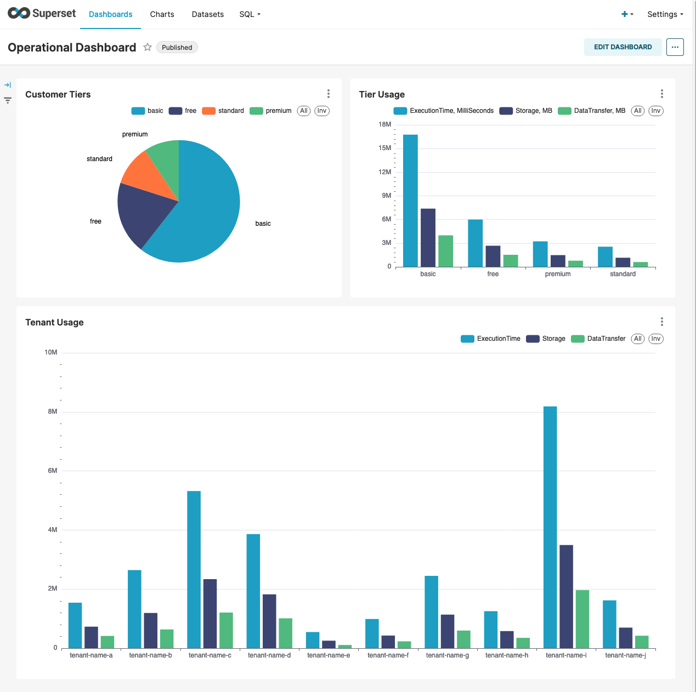
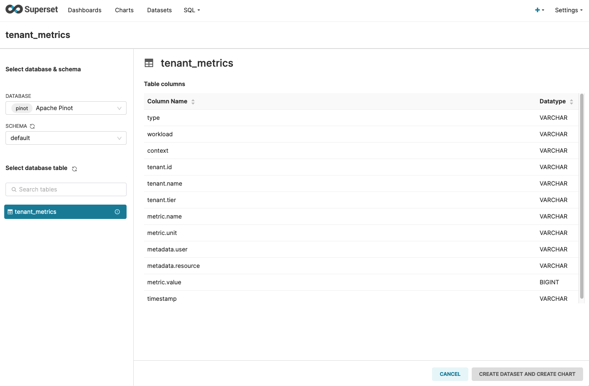
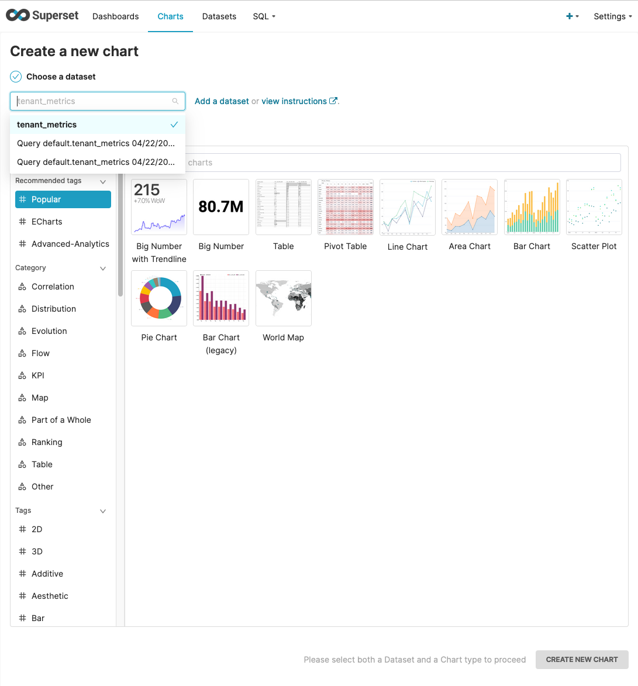
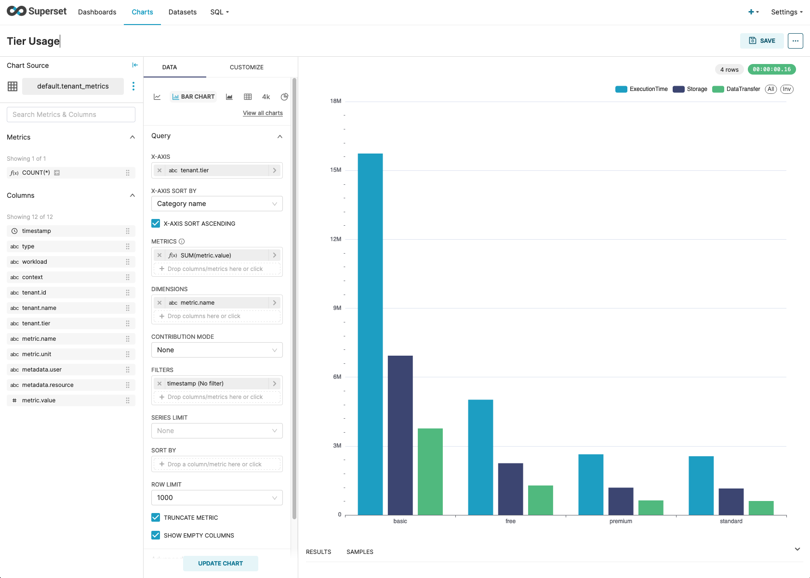

# Apache Pinot (🍷) on AWS

Today, we are going to look at the use case of ISVs that are building amazing SaaS products on AWS by leveraging the breadth and depth of AWS Services. One of the common use case for SaaS is tenant management and measurement. For SaaS providers, its common to have customers across different tiers and also its important to understand the distribution of customers across those tiers and understand customers usage patterns to scale up and scale down their infrastructure.



> Example JSON object for a single record

```json
{
    "type": "Application",
    "workload": "PhotoApplication",
    "context": "PhotoUploadService",
    "tenant": {
        "id": "tenant-id-1",
        "name": "tenant-name-a",
        "tier": "standard"
    },
    "metric": {
        "name": "DataTransfer",
        "unit": "MB",
        "value": 810
    },
    "timestamp": "1593734382",
    "metadata": {
        "user": "user-4",
        "resource": "load-balancer"
    }
}
```
## Apache Pinot Cluster

>EKS cluster with Apache Pinot Quickstart cluster example

```bash
kubectl get all -n pinot-quickstart
```

We can map the controller port to see the cluster information

> Setup port forwarding for Apache Pinot Controller interface
```bash
kubectl port-forward service/pinot-controller-external 9000:9000 -n pinot-quickstart
```

## Create Amazon Kinesis Data Stream
Amazon Kinesis Data Streams is a serverless streaming data service that makes it easy to capture, process, and store data streams at any scale. Its a very predictable and reliable managed streaming service delivering 1MB/sec per shard and 1000 records/sec write throughput and 2MB/sec read throughput.  

> Create Amazon Kinesis Data Stream with 2 shards

```bash
aws kinesis create-stream \
    --stream-name tenant_metrics_rtasummit2023 \
    --shard-count 2
```

> Check the status of the stream

```bash
aws kinesis describe-stream --stream-name tenant_metrics_rtasummit2023
```

## Creating Apache Pinot Real-time Table

Create a real-time apache pinot table that ingest data from Amazon Kinesis

> Download Apache pinot binaries
```bash
PINOT_VERSION=0.12.0 #set to the Pinot version you want to use

wget https://downloads.apache.org/pinot/apache-pinot-$PINOT_VERSION/apache-pinot-$PINOT_VERSION-bin.tar.gz
```

> Extract the files

```bash
tar -zxvf apache-pinot-$PINOT_VERSION-bin.tar.gz
```


> Change into Apache Pinot binary folder
```bash
cd apache-pinot-$PINOT_VERSION-bin
```


> Create a REALTIME Pinot table by providing the schema file and table configuration
```bash
./bin/pinot-admin.sh AddTable \
    -schemaFile ../data/schema.json \
    -tableConfigFile ../data/table-config.json \
    -controllerHost localhost \
    -controllerPort 9000 -exec
```

> Generate metrics data and push it to Amazon Kinesis Stream

```bash
python application-metrics-generator.py tenant_metrics_rtasummit2023
```

Once you have the data being published to Kinesis Data Streams, you can navigate to Apache Pinot Dashboard and query the data using **Query Console**

> Use this SQL query to view the data across
```sql
select tenant.tier, metric.name, sum(metric.value), metric.unit
from tenant_metrics
group by metric.name, tenant.tier, metric.unit
order by tenant.tier

```

## Use Apache Superset to visualize the data
Apache Superset is lightweight easy to use, BI tool with rich feature set. Apache Superset has support for Apache Pinot as a data source.

> Running Apache Superset on EKS

```bash
kubectl get all -n superset
```

> Setup port forwarding for Apache Superset to be able to use the superset UI
```bash
kubectl port-forward service/superset 8088:8088 --namespace superset
```

> Create a database connection, in this case Apache Pinot connection under settings


The format of the connection string is like below

```
pinot://<pinot-broker-host>:<pinot-broker-port><pinot-broker-path>?controller=<pinot-controller-host>:<pinot-controller-port>
```

For our setup, use the below connection string
```
pinot+http://pinot-broker.pinot-quickstart:8099/query?controller=http://pinot-controller.pinot-quickstart:9000/
```

And provide a friendly `Display Name` e.g. **Apache Pinot**

Once you have the `database connection` setup, you can create a **Dataset** using the Apache Pinot table

> Create dataset in Apache Superset



Navigate to **Charts** and then click **+Chart** button to add new chart. Select your **Dataset** that you created in previous step.

> Create new charts using Dataset



Select **Bar Chart** and then click **Create New Chart**

> Provide dimensions, metric, filtering options and name and **Save**



## Cleanup

Follow the steps below to clean-up resources from your account.

> Delete table from Apache Pinot

```bash
./bin/pinot-admin.sh DeleteTable \
-tableName tenant_metrics_rtasummit2023 \
    -controllerHost localhost \
    -controllerPort 9000 -exec
```

> Delete schema from Apache Pinot
```bash
./bin/pinot-admin.sh DeleteSchema \
-schemaName tenant_metrics_rtasummit2023 \
    -controllerHost localhost \
    -controllerPort 9000 -exec
```

> Delete kinesis data stream

```bash
aws kinesis delete-stream --stream-name tenant_metrics_rtasummit2023
```


